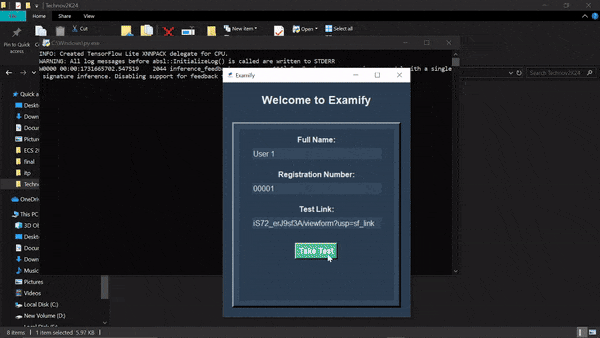

# Examify - AI-Powered Fair Exam Conduction

Examify is a Python-based Windows application developed during the **Technov2K24** 24-hour hackathon at VIT-AP. It ensures fair online exam conduction using AI, preventing unethical practices like screen sneaking, tab switching, or window navigation.

Developed using **OpenCV**, **Mediapipe**, **FastAPI**, and **Selenium**, the app integrates a simple **Tkinter** user interface to manage the entire exam process seamlessly.

---

## Table of Contents

1. [Features](#features)
2. [Technologies Used](#technologies-used)
3. [How It Works](#how-it-works)
4. [Installation](#installation)
5. [App demo](#app-demo)
6. [Contributors](#contributors)
7. [Note](#note)
8. [License](#license)

---

## Features

- **AI-Powered Monitoring**:
  - Detects gaze direction and suspicious head movements using Mediapipe’s **Face Mesh**.
  - Tracks actions such as sneaking glances at another screen, looking away for prolonged periods, or moving out of frame.
  
- **Warning System**:
  - Issues audible alerts if suspicious activity exceeds a threshold.
  - Warning score accumulates with continued violations.

- **Secure Browser**:
  - Opens the exam link in Chromium in fullscreen mode using **Selenium**.
  - Blocks keys and prevents switching windows or tabs.

- **Automated Workflow**:
  - Camera preview ensures proper monitoring setup before the exam starts.
  - Automatically closes the browser and stops the camera after the exam duration.

- **Data Recording**:
  - Sends student details, warning scores, and credibility scores to the server.
  - Stores all records in a **CSV** file for teacher evaluation.

---

## Technologies Used

- **Python**:
  - OpenCV for real-time video processing.
  - Mediapipe for face mesh detection.
  - Selenium for browser automation.
  - FastAPI for server-side processing and storage.
  - Tkinter for the graphical user interface.
- **Chromium**: Fullscreen exam browser.
- **CSV**: Used for storing student records.

---

## How It Works

### 1. User Login
- A **Tkinter UI** collects:
  - Name
  - Registration Number
  - Exam Link

### 2. Terms and Conditions
- Students are shown the rules and must agree to proceed.

### 3. Monitoring Setup
- A **15-second camera preview** ensures proper face detection using OpenCV and Mediapipe.
- Face mesh data is processed to detect gaze direction and monitor behavior.

### 4. Exam Conduction
- The app opens the exam link in a Chromium browser (fullscreen).
- Background monitoring tracks the student’s activity.
- Unauthorized actions (e.g., sneaking glances, switching tabs) increase the warning score.

### 5. Post-Exam
- At the end of the exam duration:
  - Chromium browser and camera are closed automatically.
  - Warning scores and credibility scores are sent to the server.

### 6. Data Storage
- The server saves all student data (Name, Registration Number, Warning Score, Credibility Score) in a **CSV** file for teacher access.

---

## Installation

### Execute the following commands in your command prompt or terminal
#### git clone https://github.com/prodev717/Examify.git
#### cd Examify
#### pip install -r requirements.txt
#### python main.py

---

## App demo

---

## Contributors

### Ganesh M
- **GitHub**: [prodev717](https://github.com/prodev717)  
- **Role**: Backend Developer  
- **Contributions**:
  - Developed the FastAPI server for data handling and storage.
  - Implemented real-time face detection using OpenCV and Mediapipe.
  - Managed threading and background monitoring processes.
  - Configured Selenium for secure browser automation.

## VK Rohith
- **GitHub**: [VK Rohith](https://github.com/RohiVK)  
- **Role**: Frontend Developer  
- **Contributions**:
  - Designed the user interface using Tkinter.
  - Built the exam initiation and rules agreement workflow.

---

## Note

### Before using the app, ensure the ChromeDriver path is set correctly in the code and the FastAPI server is running. To start server run start_server.bat

---

## License

This project is licensed under the MIT License. See the [LICENSE](LICENSE) file for details.
